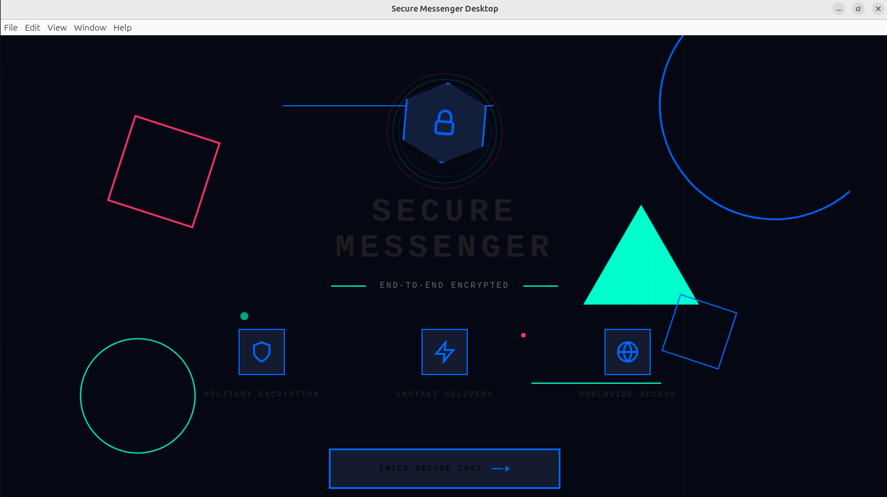
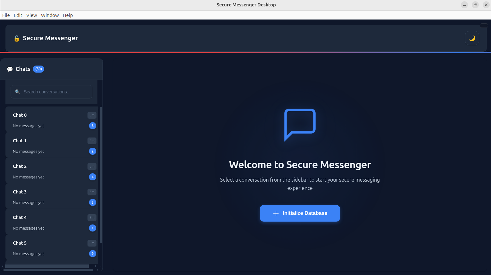
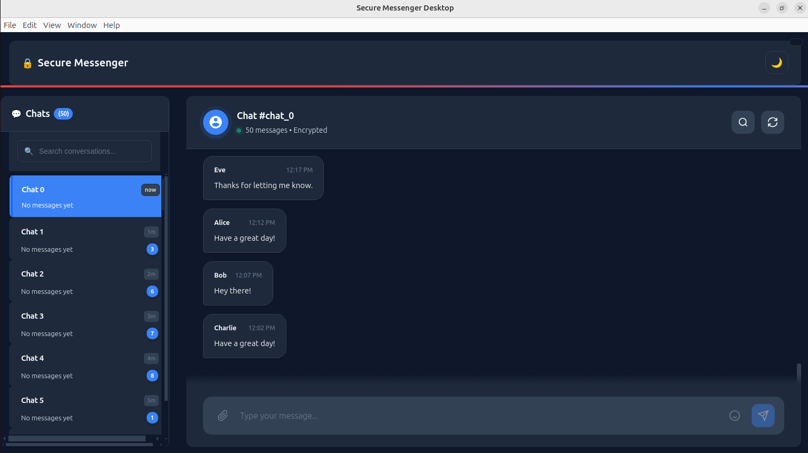

# Secure Messenger Desktop - Chat List + Sync Simulator

A secure messenger desktop application built with Electron, React, and TypeScript that demonstrates efficient local data access, real-time synchronization, and security best practices.

## Features

### Core Requirements Implemented

- **Local Database (SQLite)**: Efficient data storage with proper indexing and pagination
- **Real-time Sync**: WebSocket-based message synchronization with connection health monitoring
- **Virtualized UI**: High-performance chat list using react-window for large datasets
- **Security Boundaries**: Clean separation of encryption/decryption logic with data sanitization
- **Connection Resilience**: Exponential backoff reconnection and heartbeat monitoring

### Technical Features

- **200+ chats** and **20,000+ messages** seed data
- **Pagination**: Efficient 50-item pagination for both chats and messages
- **Search**: Full-text search within chat messages
- **Connection States**: Visual indicators for Connected/Reconnecting/Offline states
- **Message Sync**: Real-time message updates via WebSocket
- **Security Service**: Placeholder encryption with proper data sanitization

## Architecture Overview

### Module Structure

```
src/
├── main/                 # Electron main process
│   ├── main.ts          # Main application entry point
│   └── preload.ts       # Secure IPC bridge
├── renderer/            # React frontend
│   ├── components/      # UI components
│   ├── store/          # Redux state management
│   └── App.tsx         # Main React component
├── database/           # SQLite database layer
│   └── DatabaseService.ts
├── services/           # Business logic services
│   ├── WebSocketServer.ts
│   ├── WebSocketClient.ts
│   └── SecurityService.ts
└── types/              # TypeScript type definitions
    └── index.ts
```

### Data Flow

1. **Database Layer**: SQLite with proper indexes on `lastMessageAt` and `chatId/ts`
2. **WebSocket Layer**: Server emits messages every 1-3 seconds, client receives and stores
3. **Security Layer**: All sensitive data is sanitized before logging
4. **UI Layer**: React with Redux Toolkit for state management, virtualized lists for performance

### Security Architecture

- **Encryption Boundaries**: SecurityService provides clear encrypt/decrypt interfaces
- **Data Sanitization**: Message bodies are redacted from logs and error messages
- **IPC Security**: Context isolation with preload script for secure main-renderer communication
- **Input Validation**: Message integrity validation before database storage

## Screenshots

### Application Landing Page



### Home Page



### Chat Page



These screenshots showcase:

- **ChatList Component**: Virtualized chat list with 200+ chats, search functionality, and unread indicators
- **MessageView Component**: Real-time message display with pagination and smooth scrolling
- **ConnectionIndicator Component**: Visual status indicator showing connection state (Connected/Reconnecting/Offline)
- **Security Features**: Encrypted message display and secure data synchronization

## Setup Instructions

### Prerequisites

- Node.js 16+
- npm or yarn

### Installation

```bash
# Clone the repository
git clone git@github.com:mwichabe/Secure-Messeger.git
cd Secure-Messeger

# Install dependencies
npm install

# Start development server
npm start
```

### Build for Production

```bash
# Build the application
npm run build

# Package for distribution
npm run package
```

## Database Schema

### Tables

```sql
-- Chats table with indexes for performance
CREATE TABLE chats (
  id TEXT PRIMARY KEY,
  title TEXT NOT NULL,
  lastMessageAt INTEGER NOT NULL,
  unreadCount INTEGER DEFAULT 0
);

-- Messages table with foreign key constraints
CREATE TABLE messages (
  id TEXT PRIMARY KEY,
  chatId TEXT NOT NULL,
  ts INTEGER NOT NULL,
  sender TEXT NOT NULL,
  body TEXT NOT NULL,
  FOREIGN KEY (chatId) REFERENCES chats (id) ON DELETE CASCADE
);

-- Performance indexes
CREATE INDEX idx_chats_lastMessageAt ON chats (lastMessageAt DESC);
CREATE INDEX idx_messages_chatId_ts ON messages (chatId, ts DESC);
CREATE INDEX idx_messages_body_fts ON messages (body);
```

## Performance Optimizations

### Database

- **Indexes**: Proper indexing on frequently queried columns
- **Pagination**: Never loads full tables into memory
- **Transactions**: Batch operations for seed data

### UI

- **Virtualization**: react-window for efficient large list rendering
- **Memoization**: React.memo and useCallback for minimal re-renders
- **Lazy Loading**: Messages loaded on-demand with pagination

### Connection

- **Exponential Backoff**: Smart reconnection with jitter
- **Heartbeat**: 10-second ping/pong for connection health
- **State Management**: Clear connection state machine

## Security Considerations

### Current Implementation

- **Placeholder Encryption**: Base64 encoding as encryption placeholder
- **Data Sanitization**: All sensitive data redacted from logs
- **Input Validation**: Message structure validation before processing

### Production Recommendations

1. **Real Encryption**: Replace base64 with AES-256-GCM or libsodium
2. **Key Management**: Secure key derivation from user credentials
3. **Memory Protection**: Secure memory allocation for sensitive data
4. **Crash Reporting**: Sanitize crash dumps to prevent data leaks
5. **DevTools Protection**: Disable DevTools in production builds

## Trade-offs and Future Improvements

### Current Trade-offs

- **Simplified Encryption**: Base64 placeholder for demo purposes
- **Single Process**: WebSocket server runs in same process (simpler but less realistic)
- **Basic Search**: Simple LIKE search instead of full FTS
- **No Persistence**: Connection state not persisted across restarts

### With More Time

1. **Real Encryption**: Implement proper end-to-end encryption
2. **Separate Server**: Standalone WebSocket server for realistic architecture
3. **Advanced Search**: Full-text search with ranking
4. **Message Status**: Delivered/read receipts
5. **File Sharing**: Secure file transfer capabilities
6. **User Authentication**: Proper user management system
7. **Message History**: Message expiration and archival
8. **Performance Testing**: Load testing with larger datasets

## Testing

```bash
# Run the application
npm start

# Test features:
# 1. Click "Seed Data" to populate 200 chats and 20,000 messages
# 2. Scroll through virtualized chat list
# 3. Select chats to view messages
# 4. Use search to find messages
# 5. Click "Simulate Drop" to test reconnection
# 6. Observe real-time message updates
```

## System Requirements

- **Operating Systems**: Windows 10+, macOS 10.14+, Linux (Ubuntu 18.04+)
- **Memory**: 4GB RAM minimum (8GB recommended for large datasets)
- **Storage**: 100MB available space
- **Network**: WebSocket connection for sync features

## License

ISC License - see LICENSE file for details.

---

**Note**: This is a demonstration application for assessment purposes. The encryption implementation is intentionally simplified and should not be used in production environments.

# Secure-Messeger
